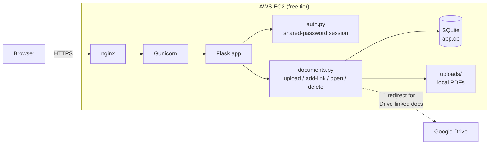

# C41 Document Hub

A small internal tool for ~10 known users to catalog PDF documents —
drop in a local file or paste a Google Drive link — behind a single
shared password. Flask + SQLite, deployed on a single AWS EC2
free-tier instance.

## Architecture

- `Auth` gates every route with one shared password (no per-user accounts).
- `Docs` handles both storage paths: uploaded PDFs are saved to local
  disk, pasted Drive links are stored as a URL and redirected to on open.
- All state — the SQLite file and the `uploads/` folder — lives on the
  instance's EBS volume.
