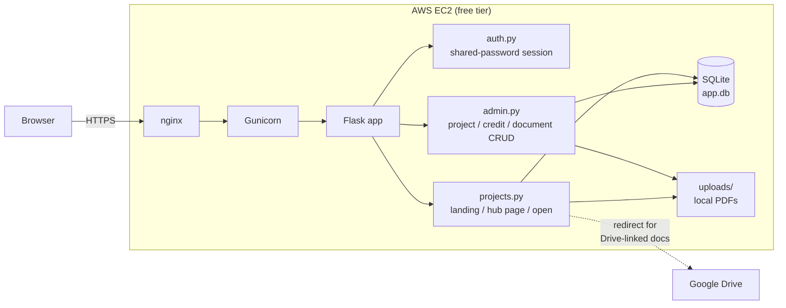

# C41 ProjectHub

Turns each shoot into its own project page: title, credits, documents/links,
callsheets, and catering menus, filled into a public hub page anyone with the
link can open — no login. Managing projects (creating, editing, uploading)
stays behind one shared password. Flask + SQLite on a single AWS EC2
free-tier instance.

## Architecture

<<<<<<< HEAD
- `Auth` gates every route with one shared password (no per-user accounts).
- `Docs` handles both storage paths: uploaded PDFs are saved to local
  disk, pasted Drive links are stored as a URL and redirected to on open.
- All state — the SQLite file and the `uploads/` folder — lives on the
  instance's EBS volume.
=======
- **Public** (no login): the project list at `/` and each hub page at `/p/<slug>`.
- **Admin** (shared password): create/edit projects, add credits, upload PDFs
  or paste Drive links.
- Each hub page is `templates/hub.html` filled with that project's data —
  the same design as the original `ProjectHub.html` reference.
>>>>>>> 0383eaf (Turn ProjectHub into a multi-project template generator)
